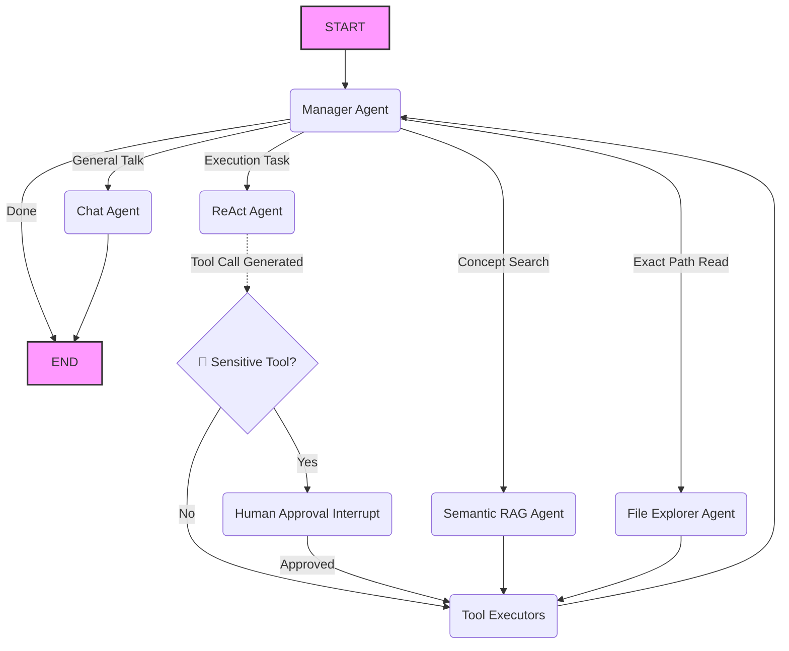

# 🚀 DevAI Copilot

DevAI Copilot is a modular, TypeScript-based AI developer assistant that combines:
- **LangGraph state-machine orchestration** for controllable multi-step reasoning.
- **Specialized agents** for routing, semantic understanding, file exploration, execution, and chat.
- **A CLI experience** with **human-in-the-loop approval** for sensitive tool actions.

This repository is organized as a monorepo with independent packages for core orchestration, tools, and CLI runtime.

---

## 📦 Repository Structure

```text
.
├── apps/
│   └── cli/                 # Interactive terminal app (startup wizard + chat loop)
├── packages/
│   ├── core/                # LangGraph state, workflow, and agents
│   └── tools/               # File-system + git tools exposed to agents
├── README.md
└── package.json             # Workspace-level scripts
```

### Workspace Packages

- **`@devai/core`**
  - Defines shared state annotations (`DevAIState`).
  - Implements agent classes (`Manager`, `ReAct`, `File Explorer`, `Semantic RAG`, `Chat`).
  - Builds and compiles the LangGraph workflow with a MemorySaver checkpointer.

- **`@devai/tools`**
  - Exposes typed LangChain tools:
    - Filesystem: `read_file`, `write_file`, `list_directory`
    - Git: `git_status`, `git_diff`, `git_commit`
  - Exports grouped tool sets (`readOnlyTools`, `fileSystemTools`, `devOpsTools`, `allTools`).

- **`@devai/cli`**
  - Bootstraps model choices (Cloud / Local / Hybrid).
  - Builds an in-memory vector retriever by scanning and chunking the target codebase.
  - Runs an interactive chat loop and handles HITL interrupts.

---

## 🧠 Architecture at a Glance



### Agent Responsibilities

1. **Manager Agent**
   - Produces structured routing decisions using a Zod schema.
   - Chooses between `semantic_rag`, `file_explorer`, `react`, `chat`, `end`, or `human`.

2. **Semantic RAG Agent**
   - Answers conceptual codebase questions from retrieved snippets.
   - Explicitly avoids hallucinating context outside retrieved documents.

3. **File Explorer Agent**
   - Read-only inspection using file/directory tools.
   - Ideal for direct path reads and repository exploration.

4. **ReAct Agent**
   - Uses bound tools for implementation tasks and git operations.
   - Executes development actions while respecting the global HITL gate.

5. **Chat Agent**
   - Handles conversational requests without tool execution.

---

## 🛡️ Human-in-the-Loop (HITL) Safety

Sensitive tool calls are interrupted before execution and require explicit approval in CLI.

Currently flagged as sensitive in workflow:
- `write_file`
- `git_status`
- `git_diff`
- `git_commit`

When an interrupt is triggered:
1. Execution pauses.
2. The CLI displays requested tool names.
3. User confirms with `Y/N`.
4. On approval, graph resumes; otherwise action is denied.

---

## 🔍 Semantic Retrieval Flow

On startup, the CLI builds a retriever with these steps:
1. Resolve context path from `DEVAI_CONTEXT_PATH` or fallback to current working directory.
2. Load supported text/code files recursively (`.ts`, `.js`, `.json`, `.md`, `.py`, `.yaml`, `.yml`).
3. Filter noisy paths (`node_modules`, `dist`, `.git`, lock files).
4. Split into chunks (`chunkSize: 1000`, `chunkOverlap: 200`).
5. Embed and store in a `MemoryVectorStore`.
6. Retrieve top-k snippets (`k = 3`) per semantic query.

---

## ⚙️ Prerequisites

- **Node.js 20+** (workspace enforces `>=20.0.0`)
- **npm**
- **Ollama** running locally for local/hybrid execution
- Optional `.env` with `GOOGLE_API_KEY` for Gemini-powered cloud/hybrid flows

---

## 🚀 Getting Started

### 1) Install dependencies

```bash
npm install
```

### 2) Build all workspaces

```bash
npm run build
```

### 3) Run the CLI

```bash
npm run build --workspace @devai/cli
npm run start --workspace @devai/cli
```

---

## 🧪 Useful Commands

```bash
# Build all packages/apps
npm run build

# Lint all workspaces (if lint scripts exist)
npm run lint

# Run tests in all workspaces (if test scripts exist)
npm run test
```

---

## 🧩 Runtime Configuration

### Environment variables

- `GOOGLE_API_KEY` (optional)
  - Enables Gemini model usage for cloud/hybrid modes.
  - If missing, cloud selection gracefully falls back to local Ollama.

- `DEVAI_CONTEXT_PATH` (optional)
  - Absolute path to the repository/codebase to index for semantic retrieval.
  - If unset, defaults to the current working directory.

Example:

```bash
DEVAI_CONTEXT_PATH=/absolute/path/to/your/project
GOOGLE_API_KEY=your_key_here
GEMINI_MODEL=gemini_model_here
OLLAMA_MODEL=ollama_model_here
```

---

## 💬 Example Prompts

- "How does the routing logic work in this project?"
- "Read `packages/core/src/workflow.ts` and summarize it."
- "Create a new utility file and implement factorial with tests."
- "Show me the current git diff for tools package."

---

## 📌 Notes & Current Limitations

- Vector store is in-memory (rebuilt each CLI session).
- HITL sensitivity list is currently static in workflow.
- Tooling focuses on filesystem + git primitives (not arbitrary shell execution).
- Workspace test/lint coverage depends on scripts defined in each package.

---

## 🤝 Why this project matters

DevAI Copilot demonstrates a practical pattern for building trustworthy coding agents:
- **Explicit state machines over hidden loops**
- **Role-specialized agents over one giant prompt**
- **User approval checkpoints for high-impact actions**
- **Local-first retrieval for code privacy and accuracy**

## 🌍 Open Source & Contributing

**DevAI Copilot is open-source and open to everyone!** This project is a foundation, and I am actively looking for developers to configure, expand, and improve it. Whether you want to add new LangChain tools (like terminal execution), integrate persistent database memory (like SQLite/Postgres), refine the agent prompts, or build a frontend UI—your contributions are highly welcome.

**How to get involved:**

1. **Fork** the repository.
2. **Create** a new branch for your feature or bugfix.
3. **Commit** your changes.
4. **Submit** a Pull Request.

Let's build the future of autonomous, safe AI developer assistants together. Feel free to open an issue if you have ideas, questions, or just want to discuss the architecture!
