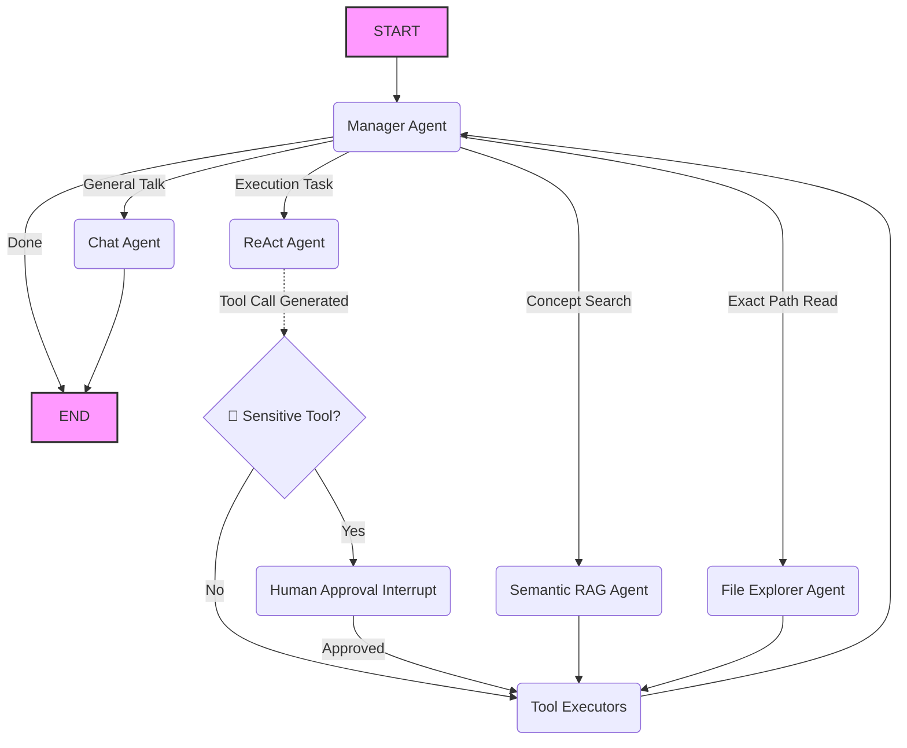

# 🚀 DevAI Copilot

DevAI Copilot is a state-of-the-art, autonomous AI DevOps engineer and developer assistant. Built on a sophisticated **State-Machine Orchestration** architecture using [LangGraph](https://github.com/langchain-ai/langgraphjs), it seamlessly bridges the gap between high-level reasoning and local, secure execution. 

This is not a simple LLM wrapper—it is a hyper-capable reasoning engine running across a multi-agent orchestrated graph.

---

## 🔥 Core Features

### 1. 🧠 Hybrid Intelligence Orchestration
DevAI gives you the best of both cloud speed and local privacy. 
- **The Manager (Gemini 1.5 Flash)**: Acts as the high-speed, cost-efficient brain that intelligently routes user tasks and analyzes history.
- **The Workers (Local Ollama / LLaMA 3.1)**: Specialized agents (`semantic_rag`, `file_explorer`, `react`) process complex code search queries and execute sensitive environment tools locally without sending your codebase to the cloud.

### 2. 🛡️ Human-in-the-Loop (HITL) execution pipeline
DevAI's architecture includes a strict safety boundary node for highly-sensitive actions (like `write_file` or `run_command`).
- The graph employs LangGraph v2 `interrupt()` mechanics.
- If the `ReActAgent` determines code must be written or terminal commands must be run, execution **pauses**.
- The CLI prompts the developer for a clear `Y/N` sequence. Execution sits completely stalled until explicitly approved, putting the developer safely in control of AI terminal workflows.

### 3. 🔍 Semantic Code Awareness (RAG)
It features a customized Retrieval-Augmented Generation implementation leveraging local embeddings into an in-memory Vector Store.
- Instead of feeding massive, expensive context windows arbitrarily, DevAI Copilot's `Manager` identifies when you are asking conceptual questions (e.g., "How does authentication work?").
- The system activates the `SemanticRagAgent`, converting your codebase into mathematical vector chunks to locate the exact abstract concepts fast and intelligently.

### 4. 🔀 Specialized Multi-Agent Roles
State transitions trigger specialized mini-agents.
- **`Manager`**: The router.
- **`Chat`**: Streams native conversational greetings token-by-token.
- **`File_Explorer`**: Navigates absolute and relative directory structures dynamically.
- **`ReAct`**: Operates filesystem and Git execution via bound LangChain tools.

---

## 🛠️ Architecture Flow


---

## 🚀 Getting Started

### Prerequisites
- [Node.js](https://nodejs.org/en) (v18+)
- [Ollama](https://ollama.com/) running locally (for fully local and hybrid processing)
- (Optional) `.env` config with `GOOGLE_API_KEY` for Hybrid execution speeds.

### Installation

1. **Clone & Install Dependencies**
```bash
git clone https://github.com/your-username/devai-copilot.git
cd devai-copilot
npm install
```

2. **Build Workspaces**
```bash
npm run build --workspaces
```

3. **Start the Copilot CLI**
```bash
cd apps/cli
npm run start
```

### Usage
On startup, you can choose your desired architecture:
1. **Fully Cloud** *(Default)*
2. **Fully Local** *(Ollama models)*
3. **Hybrid** *(Manager: Cloud, Workers: Local)*

Try commands like:
- *"Hello, what can you do?"* (Routed to ChatAgent natively)
- *"How does the workflow state machine work?"* (Routed to SemanticRag)
- *"Write a new typescript function that calculates factorial down in the /tmp directory"* (Routed to ReAct -> Hits Human Approval Node -> Executes if Y)

---
*Built as a showcase for advanced Agentic Workflow implementations.*
